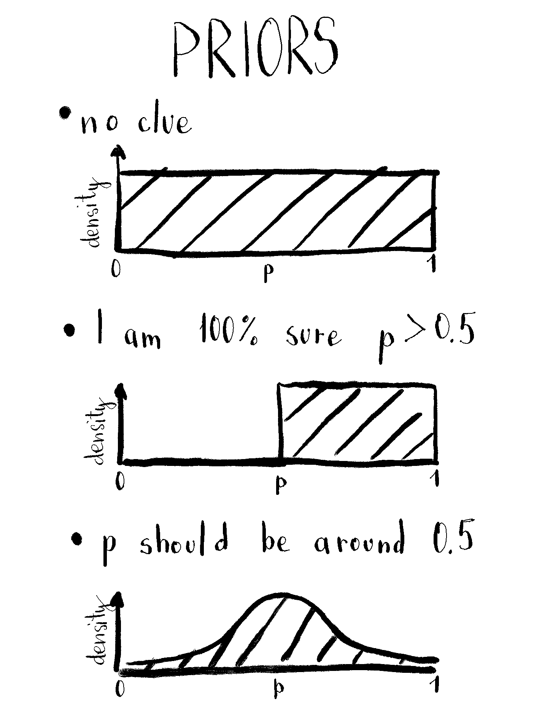
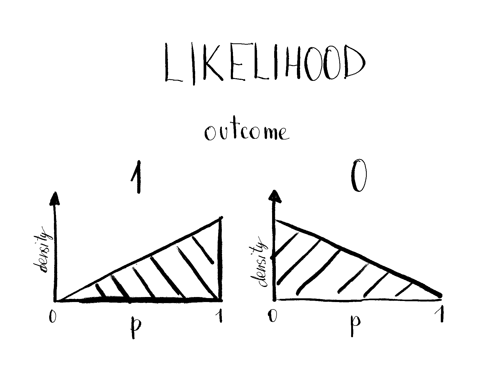

I've struggled many times to dive into Bayesian inference. I attended 10+ hour course (and passed it) without properly understanding what's going on. Then I, while watching [the talk about linear models and using common sense](https://www.youtube.com/watch?v=68ABAU_V8qI)^[Vincent gave a couple of amazing talks on solving problems using Bayesian inference. [Take a look.](https://koaning.io/talks.html)], came across Statistical Rethinking [book](https://xcelab.net/rm/statistical-rethinking/) and [video course](https://www.youtube.com/watch?v=4WVelCswXo4). [^1]

[^1]: I think they supplement each other well. If you need to pick one, go with the book. [The first two chapters are available for free.](http://xcelab.net/rmpubs/sr2/statisticalrethinking2_chapters1and2.pdf) 

In the early chapters, author focuses on presenting the topic with simple examples that can be solved without equations. And I started to understand what's going on. Besides that, I figured out that I learn by doing - not by listening. That's how this article (and a dashboard) was born.

## Tossing

The author introduces earth tossing example for approximating proportion of water on the earth's surface. You throw globe in the air, catch it, check your index finger, write down if it's water (1 = success) or land (0 = failure). By throwing it a lot of times you could estimate proportion of water on earth. But how sure can you be about the estimation?

Let's say `p` is probability of success, i.e. probability that we will catch the earth pointing on water which translates into proportion of earth's surface covered by water. Based on tossing outcomes we will estimate how likely is that each of that `p` could generate such data. By each `p` I mean all probabilities of success, from 0 to 1. They can be continuous or discrete. For example, you can focus only on each tenth quantile.


## Prior

In Bayesian world, your prior knowledge counts. If you don't have it, also fine, but you inference won't be as precise as it could be. Prior knowledge can be incorporated by - you guessed it - prior^[Prior probability distribution, often simply called the prior.]. Beware, this should be done before peeking into data. 

If you don't know anything about proportion of water on earth you can assign the same probability to all values of `p`. That's called a flat prior. You usually want to avoid it. It means you haven't "done your homework" and have no idea what about the process you're modeling. 

If you know that there's more than 50% of water on earth's surface, you can assign 0 prior probability to `p` less than 0.5.^[This means that `p` won't be lower than 0.5 no matter the data.] Or if you suspect the probability should be around 0.5, you can use normal (or [beta](https://en.wikipedia.org/wiki/Beta_distribution) distribution) with the mean of 0.5. In this case doesn't make sense to use too big standard deviations, since possible values are only between 0 and 1.

<center>

{width=70%}
</center>


## Likelihood

Likelihood tells you how likely is that a model with value `p` probability of success, would produce such outcome(s). In our example, there are only two outcomes, 0 and 1, for which we need to figure out the likelihoods. 

What's the probability, for example, that the model with `p = 0.9` produces the outcome 1? It's 0.9, you're right. And that holds for all `p` values between 0 and 1. We only need to normalize it to get the likelihood so all the probabilities for different `p` sum up to 1. And for the outcome 0, the probability is `1-p`. So 0.1 for `p = 0.9`, for example. Then we have to normalize it (dividing each value by their sum). 

Why normalize? All possibilities have to sum to 1. Because if `p = 1` then the probability it will produce 1 is `1`. This doesn't mean there's 100% chance that outcome 1 was generated by `p = 1`. Also other `p` can generate 1. 

<center>

{width=70%}

</center>

## Posterior

Posterior is what we are interested in. It tells the plausability of each `p` given it's prior probability and data. It's proportional to a product of likelihood and prior for each value of `p`. To get a posterior value for `p = 0.9`, you just multiply prior probability that `p = 0.9` and likelihood probability that such `p` generated observed data. Then you need to normalize it by diving posterior value by sum of posteriors for all `p`. 

### Bayesian updating

But the fun doesn't end there. Let's say you observed multiple tosses and got outcomes `010`. To get the posterior you need to calculate likelihood for such outcome, or - wait for it - you can do it iteratively. After each toss, each posterior can be used as a prior for the next toss. This means you can just calculate posterior as a normalized product of a prior and likelihood for each outcome. Like this:

<center>

{width=70%}

</center>

Simple multiplication means that posterior after `011` is the same as after `110` or `101`. It also takes care that `01` is not the same as `0011`. The posterior is narrower in the latter case. 

## Playground

I created a Shiny reactive app ([see code](https://github.com/mihagazvoda/mini-bayes-shiny)) where you can observe Bayesian updating and get intuition about it. It enables to play around with different priors, trial (toss) outcomes, and observe changes in posterior. 

<iframe width='1000px' height='600px' src='https://mihagazvoda.shinyapps.io/bayesian-updating/' >
  <p>Bayesian updating for dummies</p>
</iframe>

It's (like) magic, isn't it? 

<details>
  <summary>Click here if you want to see the example from above in R.</summary>
  ```{r echo = TRUE}
# define number of equidistant points between 0 and 1
n <- 11
p_grid <- seq(from = 0, to = 1, length.out = n)

# define flat prior (unstandardized)
prior <- rep(1, n)

# compute likelihood at each value in grid for 1 success in 3 trials
likelihood <- dbinom(1, size = 3, prob = p_grid)

# compute product of likelihood and prior
unstandardized_posterior <- likelihood * prior

# standardize the posterior, so it sums to 1
posterior <- unstandardized_posterior / sum(unstandardized_posterior)
```

```{r}
library(ggplot2)

ggplot(tibble::tibble(p_grid, posterior), aes(p_grid, posterior)) +
  geom_line() +
  geom_point() + 
  theme_classic() +
  labs(
    title = "Posterior for 1 success in 3 trails with flat prior",
    x = "Probability of succes (discrete values from p_grid)",
    y = "Posterior probability density"
  )
```
</details> 

