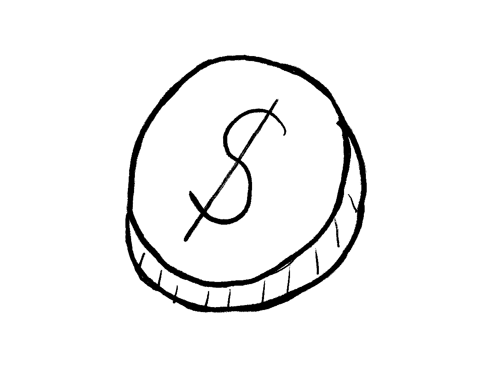

This weekend I've been solving [the March 5 538's Riddler Express](https://fivethirtyeight.com/features/can-you-bat-299-in-299-games/):  

> You have three coins in your pocket, each of which can be a penny, nickel, dime or quarter with equal probability. You might have three different coins, three of the same coin or two coins that are the same and one that is different.
> 
> Each of these coins can buy you a string whose length in centimeters equals the value of the coin in cents, i.e., the penny buys 1 cm of string, the nickel buys 5 cm of string, etc. After purchasing your three lengths of string, what is the probability that they can be the side lengths of a triangle?

Although the analytical solution is simple, I chose the simulation. More fun!



# Solution

The possible coin values, i.e. lengths of strings we can buy with the coins:^[`L` indicates integer.]

```{r}
coin_sample_space <- c(1L, 5L, 10L, 25L)
```

With the `sample` function, we sample with replacement three coins that will be in our pocket.

```{r}
sample(coin_sample_space, size = 3, replace = TRUE)
```

With these three coins, we buy strings of appropriate lengths. To determine whether the strings can shape a triangle, the sum of the shorter two has to be longer than the longest one.

```{r}
is_triangle <- function(coins) {
  sum(coins) > 2 * max(coins)
}
```

Note that `sum(coins)` already contains maximum length - that's why we are comparing it to two times the max length.

We repeat the same process zillion, okay `n`, times:

  1. Sample three coins with replacement from `coin_sample_space`.
  2. Determine whether we can shape a triangle with the purchased strings.
  

```{r}
n <- 1e5

are_triangles <- replicate(
  n, 
  is_triangle(sample(coin_sample_space, size = 3, replace = TRUE))
)

mean(are_triangles)
```

In around 34% of cases, we can shape the triangle. In the rest, we will have to live without it. 


