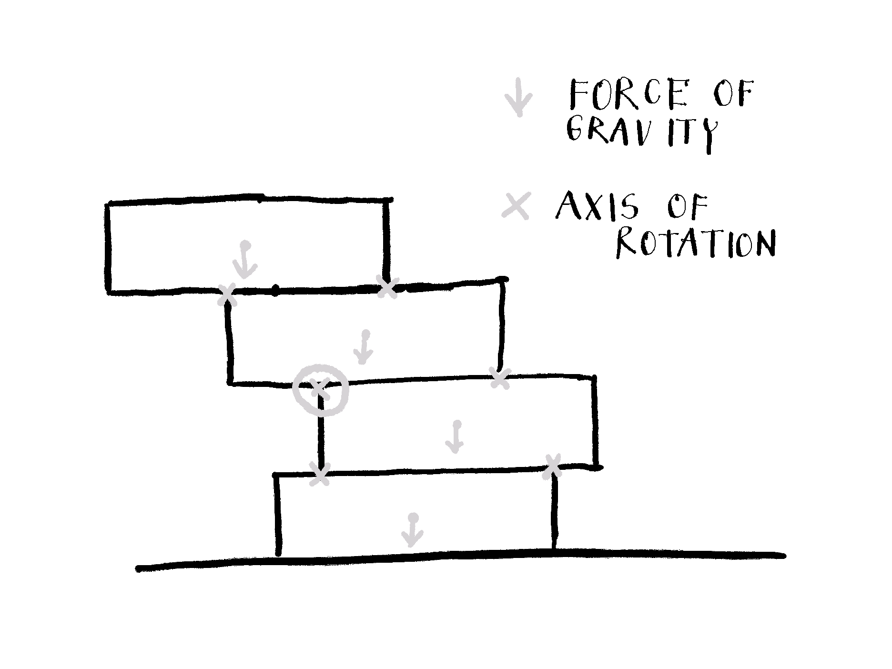
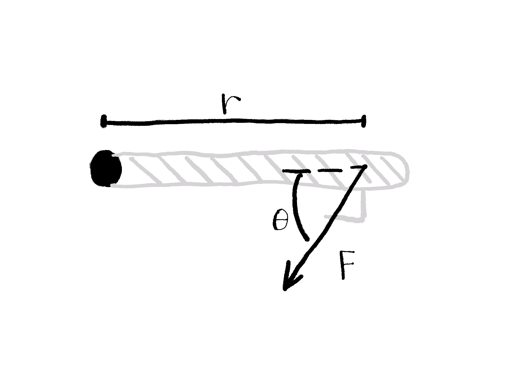

This weekend I solved the Jenga problem from [The Riddler](https://fivethirtyeight.com/tag/the-riddler/). In this post, I described my solution. But first, the riddle:

> In the game of Jenga, you build a tower and then remove its blocks, one at a time, until the tower collapses. But in Riddler Jenga, you start with one block and then place more blocks on top of it, one at a time. 
>
> All the blocks have the same alignment (e.g., east-west). Importantly, whenever you place a block, its center is picked randomly along the block directly beneath it.  
>
> On average, how many blocks must you place so that your tower collapses — that is, until at least one block falls off?

For details, [visit Riddler's official page](https://fivethirtyeight.com/features/can-you-win-riddler-jenga/).

# Solution

Let's say we have Jenga tower (as on the sketch) and want to calculate whether it's stable.



But - what happens when the tower is not stable? It crashes. Why, how? Because - we can borrow this from physics - sum of forces $F_i$ or torques $\tau_i$ doesn't equal 0. So conditions for the Jenga tower to be stable are these:
$$
\sum F_i = 0  
$$
$$
\sum \tau_i = 0
$$

Forces are not problematic: only forces of gravity act on the blocks (you can see them on the sketch) in their centers. But they get (or at least could be) neutralized by the opposite force of the blocks below and table.

Falling Jenga tower actually *rotates*, not drops. The problem is torque. Potential axes of rotations are blocks' edges.^[It could also be block center but you need huge force to break it.] They are marked with $\times$ on the sketch. Sum of torques has to be 0 for each of these axes. Torque is defined as:
$$
\tau = F \cdot r \cdot sin\theta
$$
where $\tau$ is torque, $r$ moment arm, $F$ applied force, and $\theta$  the angle between the force vector and the lever arm vector.^[Note that a $\tau$, $F$, and $r$ are in reality vectors bet here we are interested only in their magnitudes.] 



To better understand torque, look at the sketch above. It represents door from above. Someone wants to open them by applying the force at the door handle. Torque is applied on the door hinges.

The same way we can calculate (sum of) torques on all blocks' edges. The situation is simpler: we only care that gravity center of any block (or multiple blocks together) is on lateral side of the tower. This can't be compensated by the opposite torque (it's just air resistance) so the tower collapses. Gravity center of the multiple blocks is average the average of their center positions. 

# Applied solution

Now to the code. We assume each block has uniformly distributed mass and it's 1 unit long.  Each time we add block its center is picked randomly along the block beneath it. Function `calc_next_block_center` does that.

```{r}
calc_next_block_center <- function(previous_block_center) {
  previous_block_center + runif(n = 1, min = -0.5, max = 0.5)
}
```

The function `are_block_above_balanced` calculates whether are blocks above some block balanced. Condition for that is that position of their combined gravity forces are less than half a brick away from the center of the brick beneath them.

```{r}
are_blocks_above_balanced <- function(block_center, block_centers_above) {
  abs(block_center - mean(block_centers_above)) < 0.5
}
```

`get_all_possible_subtowers` can be best explained with an example. Let's say the tower has 5 blocks, 1 at the bottom, 5 at the top. The function returns subtowers [1, 2, 3, 4, 5], [2, 3, 4, 5], [3, 4, 5], and [4, 5]. 

```{r}
get_all_possible_subtowers <- function(block_centers) {
    blocks_count <- length(block_centers)
    purrr::map(1:(blocks_count - 1), ~block_centers[.:blocks_count])
}
```

With `get_tower_top_level` we are measuring how many blocks (= levels) the tower consists of when collapses.  
We always start building the tower with a block that has center at position 0. Then we place the next block center using `calc_next_block_center`. By concatenating `block_center` and `next_block_center` we get new, updated tower. Possible subtowers are then splitted by the bottom block and the blocks above and passed to `are_blocks_above_balanced`. When this is not true anymore, while loop breaks and all blocks in the off-balanced tower are counted. 

```{r}
get_tower_top_level <- function(...) {
  block_centers <- c(0)
  is_tower_balanced <- TRUE

  while(is_tower_balanced) {
    next_block_center <- calc_next_block_center(tail(block_centers, n = 1))

    block_centers <- c(block_centers, next_block_center)

    subtowers <- get_all_possible_subtowers(block_centers)
    
    is_tower_balanced <- all(purrr::map(
      subtowers, 
      ~are_blocks_above_balanced(.[1], .[-1])
    ))
  }

  length(block_centers)
}
```

Then we just simulate building of thousands of Jenga towers and calculate mean number of blocks in the collapsed towers.

```{r}
tower_heights <- purrr::map_int(1:1e4, get_tower_top_level)

mean(tower_heights)
```

We can plot the distribution:

```{r, echo=FALSE}
library(ggplot2)
ggplot(
  data.frame(tower_height = tower_heights), 
  aes(x = tower_height, y = ..prop..)
) +
  geom_bar() +
  theme_classic() +
  labs(
    title = "Distribution of number of blocks in the collapsed towers",
    y = "p",
    x = "Number of blocks"
  )
```

Now, let me rest my brain (but not nerves) by playing Jenga.
