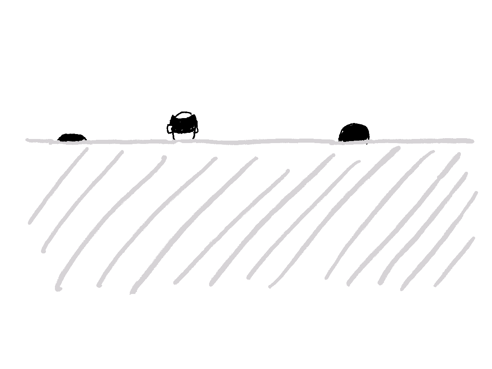

I received following riddle when asking for Bayesian resources:

> Solve this riddle.
>
> There is a wall that's kind of tall but not too tall, say 1.8m. You can only see the people who are taller than the wall.
>
> Suppose you saw 1m88, 1m90 and 1m81.
>
> What can you say about *everyone* who walked past the wall?
>
> `r tufte::quote_footer('--- [Vincent D. Warmerdam](https://twitter.com/fishnets88)')`

Challenge accepted.

To easier imagine things, let's pretend there's a group of people standing behind a wall. We don't know anything about the number of people. That's what you see:



That's what' you see from ahead's hiding behing the wall:


Let's assume their heights are normally distributed with some mean $\mu$ and standard deviation $\sigma$. A part of this distribution can't be observed since it's behind a wall.


How to write this down?
We will start with the [Bayes' theorem](https://en.wikipedia.org/wiki/Bayes%27_theorem#Statement_of_theorem). We are interested in posterior distribution $p(\mu, \sigma | D_{bias})$ of parameters $\mu$ and $\sigma$ that describe weight of people behind a wall given the observed heights $D_{bias}$. Since $p(D_{bias})$ serves as a normalizing constant that makes the posterior density integrate to one, we can throw it away.^[More about that on [Cross Validated](https://stats.stackexchange.com/questions/12112/normalizing-constant-in-bayes-theorem).] Priors of the parameters can be rewritten as their product. Likelihood is a product of likelihoods of all observed heights. But beware, we are missing some.

$$
p(\mu, \sigma | D_{bias}) = \frac{p(D_{bias} | \mu, \sigma) p(\mu, \sigma)}{p(D_{bias})} \propto p(D_{bias} | \mu, \sigma) p(\mu, \sigma) = p(\mu)p(\sigma) \prod_{i} p(h_i | \mu, \sigma)
$$

The tricky part is to calculate $p(h_i | \mu, \sigma)$. We can help ourselves with the sketch above. Our observations come only from the part of the distribution that is above the wall. So likelihoods are basically the same as from Gaussian but normalized by the density proportion that is above the wall. Without getting too much into maths^[Ok, if you *really* want it:
$$
p(h_i | \mu, \sigma) = \frac{exp(\frac{-(h_i-\mu)^2}{2\sigma^2})/(\sigma \sqrt{2\pi})}{\int_{x=h_w}^{\infty}(exp(\frac{-(x-\mu)^2}{2\sigma^2}) / (\sigma \sqrt{2\pi}))}
$$
It's way simpler than it looks.
], this can be easily calculated in R with functions `dnorm()`, to get values for probability density, and `pnorm()` to get cumulative density:

$$
p(h_i | \mu, \sigma) = \frac{dnorm(h_i, \mu, \sigma)}{pnorm(h_w, \mu, \sigma)}
$$


Both functions can take vectors for argument values. Then you just multiply likelihoods for all the points. Here's and `R` functions that does that:

```{r include=TRUE, echo=TRUE}
calc_likelihood <- function(mu, sigma, observations, wall) {
  prod(
    dnorm(observations, mu, sigma) /
      pnorm(wall, mu, sigma, lower.tail = FALSE)
  )
}
```

Once we know how to calculate likelihood, the simplest way to calculate the posterior (plausibility of the parameters of Gaussian describing all people standing behind a wall) is a grid approximation. I find it the most clear but it uses brute-force that is suitable only for the low number of parameters. It goes like this:

1. Decide on appropriate sequences of parameters values $\mu$ and $\sigma$ and their priors.^[Usually, priors should be probability densities (so they are integrated to 1) but in our case this is not a problem since we will normalize posterior at the end.] This is done in `df_mu` and `df_sigma`. Note that you can easily create Gaussian priors using `dnorm()` function with parameter values set as the first argument. I decided to use flat priors instead so one can't argue that the shift in posterior `mu` values happened due to priors, not the wall.
2. Create grid of parameter combinations. Function `crossing` does that.
3. Calculate likelihood for each combination of parameters and observed heights by calling function `calc_likelihood()` on each row.
4. Calculate posterior as a product of likelihood and parameters' posteriors. Normalize the posterior to see what's the probability of occuring for such parameters.

```{r include=TRUE, echo=TRUE}
library(dplyr)
library(tidyr)
library(purrr)

wall <- 180
observations <- c(181, 188, 190)

df_mu <- tibble(
  mu = seq(170, 190, by = 0.1),
  prior_mu = 1 # dnorm(mu, 178, 10)
)

df_sigma <- tibble(
  sigma = seq(1, 20, by = 0.1),
  prior_sigma = 1 # dnorm(sigma, 10, 5)
)

df <- crossing(df_mu, df_sigma) %>%
  rowwise() %>%
  mutate(likelihood = calc_likelihood(mu, sigma, observations, wall)) %>% 
  ungroup() %>% 
  mutate(
    posterior_unstd = likelihood * prior_mu * prior_sigma,
    posterior = posterior_unstd / sum(posterior_unstd)
  )
```

Let's see the results in `df` that is sorted by descending `posterior`:

```{r}
df %>% 
  arrange(desc(posterior)) %>% 
  head() %>% 
  mutate(across(c(posterior, posterior_unstd, likelihood), scales::scientific, 5)) %>% 
  knitr::kable()
```

The most likely parameters for Gaussian distribution describing people height standing behind a wall are $\mu \approx 185cm$ and $\sigma \approx 4.8cm$. Note that $\mu$ is smaller compared to average of observations $\bar{h} = 186.3$.   
Since our priors are flat means that posteriors are proportional to likelihoods. 
Beware: posterior values can get really small so generally it's safer to calculate using logs of values and summation instead of multiplication.

```{r}
library(ggplot2)

ggplot(df, aes(x = mu, y = sigma, z = posterior)) +
  geom_contour_filled() +
  labs(
    title = "Posterior values for different parameter combinations",
    subtitle = "Brihter colors present zones with higher posterior values."
  ) +
  theme_classic() +
  theme(legend.position = "none") +
  scale_x_continuous(expand = c(0, 0)) + 
  scale_y_continuous(expand = c(0, 0))
```


## Use cases

A lot of data we collect is biased and sometimes you know how it is biased. Now you know how to make up for that. About another such example, getting customer complaints only when they've been waiting for a long time, [talked Vincent on PyData](https://youtu.be/dE5j6NW-Kzg?t=721).
 
TODO mention that he explains it too
TODO check mckay book 
TODO maybe move to the introduction

https://youtu.be/dE5j6NW-Kzg?t=721)