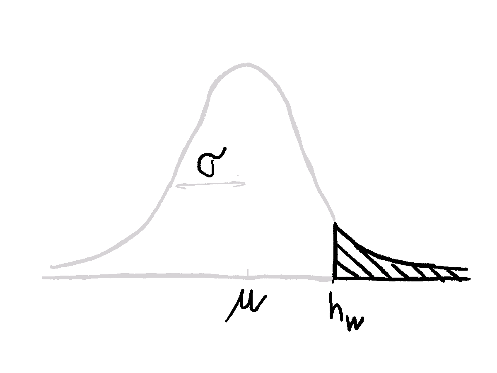

I received the following riddle when asking for Bayesian resources on Twitter:

> Solve this riddle.
>
> There is a wall that's kind of tall but not too tall, say 1.8m. You can only see the people who are taller than the wall.
>
> Suppose you saw 1m88, 1m90 and 1m81.
>
> What can you say about *everyone* who walked past the wall?
>
> `r tufte::quote_footer('--- [Vincent D. Warmerdam](https://twitter.com/fishnets88)')`

Challenge accepted.

Let's pretend there's a group of people standing instead of walking behind a wall. This way it's easier to sketch the situation. That's what we see:


This is the front view:


# Bayes to the rescue!

We assume people's heights are normally distributed with some mean $\mu$ and standard deviation $\sigma$. A part of this distribution can't be observed since it's behind the wall.



Let's start with [Bayes' theorem](https://en.wikipedia.org/wiki/Bayes%27_theorem#Statement_of_theorem). We are interested in posterior distribution $p(\mu, \sigma | D_{bias})$ of parameters $\mu$ and $\sigma$ that describe the height of people behind the wall given the observed heights $D_{bias}$. Since $p(D_{bias})$ serves as a normalizing constant that makes the posterior density integrate to one, we can throw it away.^[More about that on [Cross Validated](https://stats.stackexchange.com/questions/12112/normalizing-constant-in-bayes-theorem).] Prior $p(\mu,\sigma)$ can be rewritten as the product of priors for each parameter. The likelihood is a product of the likelihoods of all observed heights.

$$
p(\mu, \sigma | D_{bias}) = \frac{p(D_{bias} | \mu, \sigma) p(\mu, \sigma)}{p(D_{bias})} \propto p(D_{bias} | \mu, \sigma) p(\mu, \sigma) = p(\mu)p(\sigma) \prod_{i} p(h_i | \mu, \sigma)
$$

The tricky part is to calculate $p(h_i | \mu, \sigma)$. We can help ourselves with the sketch above. Our observations come only from the part of the distribution that is above the wall. So likelihoods are basically the same as from Gaussian but normalized by the density portion that is above the wall. Without getting too much into maths^[Ok, if you *really* want it:
$$
p(h_i | \mu, \sigma) = \frac{exp(\frac{-(h_i-\mu)^2}{2\sigma^2})/(\sigma \sqrt{2\pi})}{\int_{x=h_w}^{\infty}(exp(\frac{-(x-\mu)^2}{2\sigma^2}) / (\sigma \sqrt{2\pi}))}
$$
It's way simpler than it looks.
], this can be easily calculated in R with functions `dnorm()`, to get values for probability density, and `pnorm()` to get the probability that the observation is taller than the wall:

$$
p(h_i | \mu, \sigma) = \frac{dnorm(h_i, \mu, \sigma)}{pnorm(h_w, \mu, \sigma)}
$$


Both functions can take vectors for argument values. Then you multiply likelihoods for all the points. Here's an `R` function that does that:
<!-- TODO mention logarithms -->

```{r include=TRUE, echo=TRUE}
calc_likelihood <- function(mu, sigma, observations, wall) {
  prod(
    dnorm(observations, mu, sigma) /
      pnorm(wall, mu, sigma, lower.tail = FALSE)
  )
}
```

# Multiplication is all you need.

Once we know how to calculate the likelihood, the simplest way to calculate the posterior (plausibility of the parameters of Gaussian describing all people standing behind the wall) is a grid approximation. I find it the clearest but it uses brute-force that is suitable only for the low number of parameters. It goes like this:

1. Decide on appropriate sequences of parameters values $\mu$ and $\sigma$ and their priors.^[Usually, priors should be probability densities (so they integrate to 1) but in our case this is not a problem since we will normalize posterior at the end.] This is done in `df_mu` and `df_sigma`. Note that you can easily create Gaussian priors using `dnorm()` function with parameter values set as the first argument. I decided to use flat priors instead so one can't argue that the shift in posterior `mu` values happened due to priors, not the wall. Flat priors also mean  the posterior will be proportional to the likelihood.
2. Create a grid of parameter combinations. Function `crossing()` does that.
3. Calculate likelihood for each combination of parameters and observed heights by calling function `calc_likelihood()` on each row.
4. Calculate posterior as a product of likelihood and parameters' posteriors. Normalize the posterior to see what's the posterior probability of some parameter combination among all defined parameter combinations. 

```{r include=TRUE, echo=TRUE}
library(dplyr)
library(tidyr)
library(purrr)

wall <- 180
observations <- c(181, 188, 190)

df_mu <- tibble(
  mu = seq(170, 190, by = 0.1),
  prior_mu = 1 # dnorm(mu, 178, 10)
)

df_sigma <- tibble(
  sigma = seq(1, 20, by = 0.1),
  prior_sigma = 1 # dnorm(sigma, 10, 5)
)

df <- crossing(df_mu, df_sigma) %>%
  rowwise() %>%
  mutate(likelihood = calc_likelihood(mu, sigma, observations, wall)) %>% 
  ungroup() %>% 
  mutate(
    posterior_unstd = likelihood * prior_mu * prior_sigma,
    posterior = posterior_unstd / sum(posterior_unstd)
  )
```

# Posterior looks beautiful but does it make sense?

Let's see the results in `df` sorted by descending `posterior`:

```{r}
df %>% 
  arrange(desc(posterior)) %>% 
  head() %>% 
  mutate(across(c(posterior, posterior_unstd, likelihood), scales::scientific, 5)) %>% 
  knitr::kable()
```

The most likely parameters for Gaussian distribution describing people height standing behind the wall are $\mu \approx 185cm$  and $\sigma \approx 4.8cm$. Note that $\mu$ is smaller compared to the average of observations $\bar{h} = 186.3cm$.   

```{r}
library(ggplot2)

ggplot(df, aes(x = mu, y = sigma, z = posterior_unstd)) +
  geom_contour_filled() +
  labs(
    title = "Posterior values for different parameter combinations",
    subtitle = "Brighter colors present zones with higher posterior probabilities."
  ) +
  theme_classic() +
  theme(legend.position = "none") +
  scale_x_continuous(expand = c(0, 0)) + 
  scale_y_continuous(expand = c(0, 0))
```

<details>
<summary>Additional plot to better understand the posterior.</summary>

The plot below displays normalized probability densities for heights between 180 and 190cm. The normalized probability density is calculated the same as in $p(h_i|\mu, \sigma)$ above; that is divided by the portion of the Gaussian above the wall height. 

```{r}
calc_rel_dens <- function(mu, sigma, h, wall) {
  dnorm(h, mu, sigma) / pnorm(wall, mu, sigma, lower.tail = FALSE)
}

tibble(
  mu = 170,
  h = 180:190
) %>% 
  crossing(sigma = 5:20) %>% 
  rowwise() %>% 
  mutate(rel_dens = calc_rel_dens(mu, sigma, h, wall)) %>% 
  ggplot(aes(h, rel_dens, color = sigma, group = sigma)) + 
  geom_line() +
  viridis::scale_color_viridis() + 
  theme_classic() + 
  labs(
    title = "Probability densities for Gaussians with different sigmas and mu = 170",
    x = "Height [cm]",
    y = "Normalized probability density"
  )
```

To get the posterior value for some $\mu$ and $\sigma$ you just have to multiply densities (`y` values on the plot). We can see that $\sigma$ between 10 and 15 make the more sense because higher $\sigma$ values are lower for all heights and small $\sigma$ density for height 181cm is bigger but gets compensated because when multiplying with densities for 188 and 190 which are way smaller. 

</details> 

# Don't give up when your data is biased.

On PyData conference, [Vincent D. Warmerdam talked about another such example](https://youtu.be/dE5j6NW-Kzg?t=721): getting customer complaints about their waiting time only when they’ve been waiting for longer than usual. He also explains the riddle I've solved without giving the solution. 

A lot of data we collect is biased and sometimes we know how it is biased. Luckily - and skillfully - we can make up for that. 

